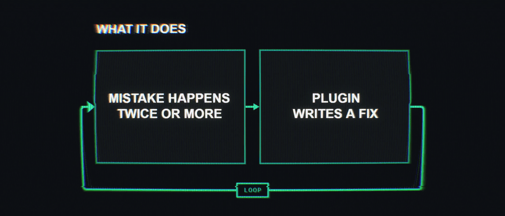

# Refine Cycle for OpenClaw

[](https://github.com/Bergschloss/Refine-Cycle-for-OpenClaw/actions/workflows/tests.yml)  

**Your agent keeps repeating the same mistake. This makes it stop.**

**Refine Cycle** watches your OpenClaw agent's tool failures across sessions. When the same failure comes back, it writes one short lesson and puts it in front of the agent from then on. Later, it records whether the failure came back.

**Cross-session by design.** An agent can make the same mistake in conversation after conversation: the same wrong date format, the same missing flag, the same command that never works on your machine. Refine Cycle remembers across conversations, so you stop explaining the same thing twice. That holds even when the agent puts the mistake right a moment later each time: making it in every conversation is the mistake, and the fix it found is what the lesson is written from. A slip made once, in one conversation, and fixed straight away is left alone.

**Measured:** on two tasks the agent kept getting wrong, it got the tool call right **20%** of the time on its own and **90%** with the plugin's lesson. A placebo note of the same length scored **7.5%**.

[**Install on your OpenClaw →**](#install)



## A simple three-step loop

1. **Notice what keeps going wrong.** One failed call may be noise. The same failure in two sessions, or five times, is a pattern.
2. **Write the smallest useful lesson.** One sentence, such as *"When calling send_report, format the date as YYYY-MM-DD, such as 2026-09-25, rather than DD/MM/YYYY."* The model may also answer that there is nothing to learn, and often does.
3. **Check the result.** Each later session records which lessons it saw and whether the failure came back after it; `/refine audit` turns that into a verdict per lesson.

## You stay in control

- At most one model call per session and three a day, on the model and account OpenClaw uses for your default agent. The plugin has no key of its own.
- `/refine list` shows your lessons and their status; `/refine disable <id>` and `/refine delete <id>` take one away, and a lesson you took away is never learned again.
- It never edits your `AGENTS.md`, `SOUL.md`, skills or memory. Lessons live in the plugin's own folder.
- It does not filter your conversation or its lessons. The evidence for a lesson (the failing call's error and arguments, and the call that fixed it) goes to that model, as your agent would send it; the lessons and the plugin's records, which keep short excerpts of failed calls, stay in its folder on your machine. With several agents, the evidence from every agent goes to the default agent's model: OpenClaw does not let a plugin's background call choose the agent.
- When it learns a lesson, it sends one line, such as "♾️ Refine Cycle — new lesson learned (lessons 412/4400)", to the chat you are talking from (or the last one you talked from, when the turn came from a cron job or the command line). The numbers are how many characters your active lessons take in the prompt, against a soft limit of 4400; it says `getting tight` from 90% and `over the soft limit` past it. Every active lesson is still shown: the limit is a warning, not a cut. Nothing else is sent unasked; `/refine` shows the lessons. `notifyOnLesson: false` turns this off.
- If a hook fails or the store is unreadable, your agent's turn goes on as if the plugin were not there, and the log says why.

## How it works


After each turn, the plugin reads the whole session from OpenClaw's history and turns each failed tool call into a fingerprint, so the same error with a different path, id or timestamp counts once. Most failures stop here, without a model call: they did not repeat, they were a network timeout or an outage, or the agent's own instructions and skills already cover them. A command that hits the tool's own time limit every time it runs is not an outage, and does get a lesson. A failure that gets through goes to the model with its evidence; when the agent fixed the call itself, the call that then succeeded is part of that evidence. A session gets one model call at most; a session with no failure of its own worth it spends its call on the oldest failure that passed every check but never reached the model, so a failure crowded out by another one in its own session is not lost. When the model finds nothing to learn from a failure, it is not asked about it again for 7 days, unless the failure comes back in a new session. A lesson the model writes must name the observed failure and the failing tool, fit in 200 characters, and not repeat a rule the agent already has. It is journaled before it becomes active, so a crash never leaves a half-written lesson. From the next prompt on, the agent's active lessons are placed ahead of its turn in a short, marked block.

Design, host contract and code layout: [docs/DESIGN.md](docs/DESIGN.md).

## What the testing shows

In a 120-session test on OpenClaw 2026.9.6 with GPT-6 Luna, the agent got the first tool call right in 36 of 40 sessions with the lesson, 8 of 40 with nothing, and 3 of 40 with a placebo note. The placebo did no better than nothing, so the gain comes from what the lesson says. The tasks were two test tools built to provoke one specific mistake each, so this shows that a correct lesson changes behaviour; how often the plugin finds one in real use is a separate number.

On 125 of the author's real coding-agent dialogs, replayed in order, the plugin sent 7 failures to the model and got 1 lesson back (commit `d7b0831`; 5 and 1 before the self-correction change). That lesson was useful: it corrected an out-of-date example in the author's own instructions that had caused the same error twice. These dialogs keep no tool-call arguments, so the model saw less than it would on a live install; most of its "nothing to learn" answers said so. Method, limits and raw data: [docs/MEASUREMENT-2026-09-25.md](docs/MEASUREMENT-2026-09-25.md).

## Install

Tested on OpenClaw 2026.9.6 (2026.9.5 is supported). The plugin runs inside OpenClaw, so it needs what OpenClaw itself needs: Node 24.16+ or 26.1+.

**1. Install the plugin.** OpenClaw warns that a git source is outside ClawHub review and asks `Install this non-ClawHub plugin source? [y/N]`; review the source, then answer `y`. `--accept-capabilities` accepts what the plugin declares it can do. In a script, with no terminal to answer the question, add `--force` after reviewing the source.

```bash
openclaw plugins install git:github.com/Bergschloss/Refine-Cycle-for-OpenClaw --accept-capabilities
```

Once the plugin is published on ClawHub (not yet), it will also install from there, with ClawHub's review and provenance instead of the git warning:

```bash
openclaw plugins install clawhub:refine-cycle-openclaw --accept-capabilities
```

**2. Let it see your sessions.** OpenClaw gives a plugin your conversation only when you allow it. Without this, Refine Cycle stays idle and says so in the log. A running gateway picks this setting up without a restart.

```bash
openclaw config set plugins.entries.refine-cycle.hooks.allowConversationAccess true
```

**3. Restart the gateway**, so it loads the newly installed plugin. `openclaw gateway restart` restarts a gateway installed as a service; a gateway you started by hand (`openclaw gateway run`) you stop and start again yourself.

```bash
openclaw gateway restart
```

**4. Check it.** It answers "No lessons yet." until a failure has repeated.

```bash
openclaw refine-cycle list
```

## Commands

| In chat | On the command line | |
|---|---|---|
| `/refine list` | `openclaw refine-cycle list` | Lessons and their status |
| `/refine status` | `openclaw refine-cycle status` | Whether learning and injection work and what blocks them, the model, calls used today, the block's size against its soft limit, the queue, the journal (`--json` on the command line) |
| `/refine disable <id>` | `openclaw refine-cycle disable <id>` | Stop showing a lesson |
| `/refine delete <id>` | `openclaw refine-cycle delete <id>` | Delete a lesson (kept as a tombstone) |
| `/refine audit` | `openclaw refine-cycle audit` | Did each lesson help: a verdict per lesson (`working`, `did not help`, `unused`, `too early`, `no recurrence window`, `unreliable`), from the sessions it was shown in and whether its failure came back after; it lists the ones worth removing and deletes nothing |
| `/refine report` | `openclaw refine-cycle report` | What the loop decided and why, in words (`--json` on the command line for the numbers) |

In chat, the commands see only the lessons of the agent you are talking to. On the command line they see every agent, and `list` says whose each lesson is; a command that did not do what was asked (an unknown id, a busy store) exits with status 1.

## Settings

Under `plugins.entries.refine-cycle.config` in `openclaw.json`. All are optional.

| Setting | Default | |
|---|---|---|
| `injectEnabled` | `true` | Show active lessons to the agent |
| `learnEnabled` | `true` | Look for repeated failures and write lessons |
| `maxModelCallsPerDay` | `3` | Model calls for writing lessons, per day |
| `minSessions` / `minOccurrences` | `2` / `5` | How often a failure must repeat (either one) |
| `maxInjectedChars` | `4400` | Soft limit of the lessons block in the prompt, in characters: every active lesson is still shown; the lesson message warns near and past it |
| `maxLessonChars` | `200` | Longest lesson accepted |
| `instructionFiles` | `AGENTS.md`, `TOOLS.md`, `SOUL.md` | Files checked so a lesson never repeats a rule you already wrote |
| `notifyOnLesson` | `true` | One line in your chat when a new lesson is learned |

## Documentation

| | |
|---|---|
| [DESIGN.md](docs/DESIGN.md) | How it works inside, the OpenClaw host contract, code layout |
| [MEASUREMENT-2026-09-25.md](docs/MEASUREMENT-2026-09-25.md) | The placebo-controlled test and the real-dialog replay, with raw data |
| [MILESTONE-1.md](docs/MILESTONE-1.md) | What the first version set out to do |

The idea and its first measurement come from [Refine Cycle for Hermes Agent](https://github.com/Bergschloss/Refine-Cycle-for-Hermes-Agent), which adapts the `/refine` concept from [Prime Intellect's Prime Agent](https://www.primeintellect.ai/blog/prime-agent).

## License

MIT © 2026 Taras Boiko
