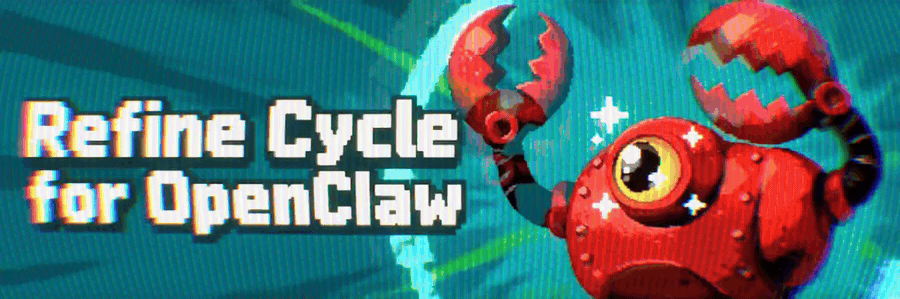

# Refine Cycle for OpenClaw



[](https://github.com/Bergschloss/Refine-Cycle-for-OpenClaw/actions/workflows/tests.yml)  

**Your agent keeps repeating the same mistake. This makes it stop.**

**Refine Cycle** looks across your OpenClaw agent's recent sessions, finds the mistakes that keep coming back, and writes one short lesson the agent sees from then on. Later, it checks whether the same mistake came back.

**Cross-session by design.** An agent can put a mistake right in one conversation and make it again in the next: the same wrong date format, the same missing flag, the same command that never works on your machine. Refine Cycle remembers across conversations, so you stop explaining the same thing twice.

**Measured:** OpenClaw on its own handles **8%** of its repeating mistakes correctly → **91%** with the plugin.

[**Install on your OpenClaw →**](#install)


## A simple three-step loop

1. **Notice what keeps going wrong.** One failed call may be noise. The same failure in two sessions, or five times, is a pattern.
2. **Write the smallest useful lesson.** One short sentence, such as *"When calling send_report, write the date as YYYY-MM-DD."*
3. **Check the result.** Later sessions show whether the failure stopped, and `/refine audit` tells you which lessons work.

## You stay in control

- It reaches a model no more than three times a day, and uses the model OpenClaw already uses. It has no key of its own.
- `/refine list` shows every lesson. `/refine delete <id>` removes one, and it is never learned again.
- It never edits your `AGENTS.md`, `SOUL.md`, skills or memory. Lessons live in the plugin's own folder, on your machine.
- It does not filter your conversation. The evidence for a lesson goes to your model the way your agent would send it.
- If something inside the plugin fails, your agent carries on as if it were not installed.

When it learns a lesson, it tells you in one line in your chat: `♾️ Refine Cycle — new lesson learned (412/4400)`. The numbers show how much room your lessons take in the agent's prompt. In the web UI and the Tray, where a plugin cannot post, your agent passes it on in its next reply.

It looks after itself: a new version installs itself (`autoUpdate: false` to be asked instead), and past the soft limit it switches off lessons that did not help (`autoTidy: false` to only be warned). Either way it tells you once.

## How it works


After each turn, the plugin reads the session's failed tool calls and turns each one into a fingerprint, so the same failure with a different id, path or time counts once. Nothing reaches the model until a failure repeats, and network hiccups or rules your own instructions already cover are skipped. Then the model is asked for one short lesson. The lesson must name the failure and the tool, and must not repeat a rule you already wrote. It is recorded before it is shown, so a crash never leaves half a lesson. From the next prompt on, the agent sees its lessons before it starts. The plugin stops early at three points: nothing repeats, a check rejects the lesson, or you turn the lesson off.

Every rule, command and setting: [docs/USAGE.md](docs/USAGE.md).

## What the testing shows

On 120 new tasks, the agent got the tool call right on the first try 8% of the time without the plugin and 91% with a lesson the plugin had learned by itself.

- In all 10 test scenarios where a lesson was possible, the plugin learned one. Two AI graders from different companies rated all 10 useful.
- The tasks used test tools built to provoke one mistake each, on OpenClaw 2026.9.6 with GPT-6 Luna. In real use the plugin will find fewer lessons.
- The method and every deviation from the plan: [docs/proof/](docs/proof/).

## Install

Needs OpenClaw 2026.9.5 or newer (tested on 2026.9.6).

**1. Install and switch it on.** OpenClaw asks you to confirm a source from outside ClawHub; answer `y`. The second line matters when you install it again after removing it: OpenClaw leaves a removed plugin switched off.

```bash
openclaw plugins install git:github.com/Bergschloss/Refine-Cycle-for-OpenClaw --accept-capabilities
openclaw plugins enable refine-cycle
```

**2. Let it see your sessions.** Without this it stays idle.

```bash
openclaw config set plugins.entries.refine-cycle.hooks.allowConversationAccess true
```

**3. Restart OpenClaw.**

```bash
openclaw gateway restart
```

**4. Check it.** Send `/refine status` in chat.

More on installing, including a gateway you started by hand: [docs/USAGE.md](docs/USAGE.md#install-in-detail).

## Commands

| | |
|---|---|
| `/refine list` | Your lessons |
| `/refine status` | Whether it works, and what stops it |
| `/refine audit` | Which lessons help |
| `/refine delete <id>` | Remove a lesson for good |
| `/refine update` | Update the plugin |

Every command, the command line and all settings: [docs/USAGE.md](docs/USAGE.md).

## Documentation

| | |
|---|---|
| [USAGE.md](docs/USAGE.md) | Commands, settings, messages, and every rule the plugin follows |
| [DESIGN.md](docs/DESIGN.md) | For maintainers: how it works inside, the OpenClaw host contract, code layout |
| [MEASUREMENT-2026-09-25.md](docs/MEASUREMENT-2026-09-25.md) | The test above and the replay on real dialogs, with raw data |

The idea and its first measurement come from [Refine Cycle for Hermes Agent](https://github.com/Bergschloss/Refine-Cycle-for-Hermes-Agent), which adapts the `/refine` concept from [Prime Intellect's Prime Agent](https://www.primeintellect.ai/blog/prime-agent).

## License

MIT © 2026 Taras Boiko
